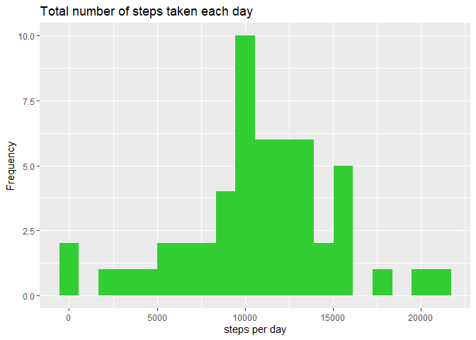
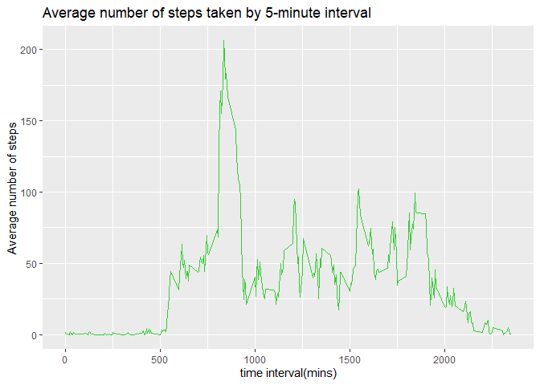
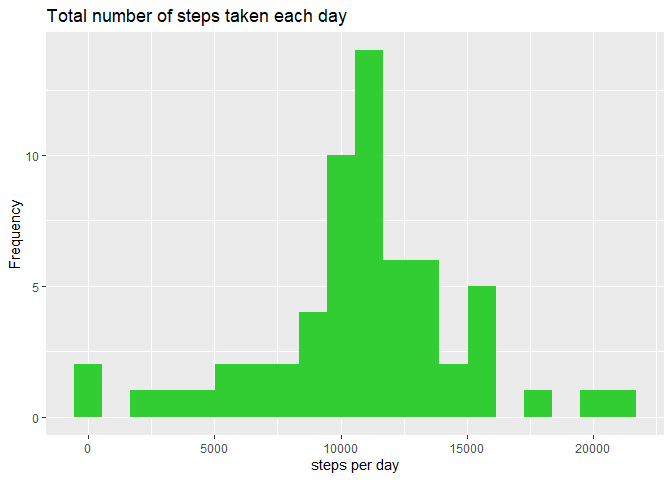
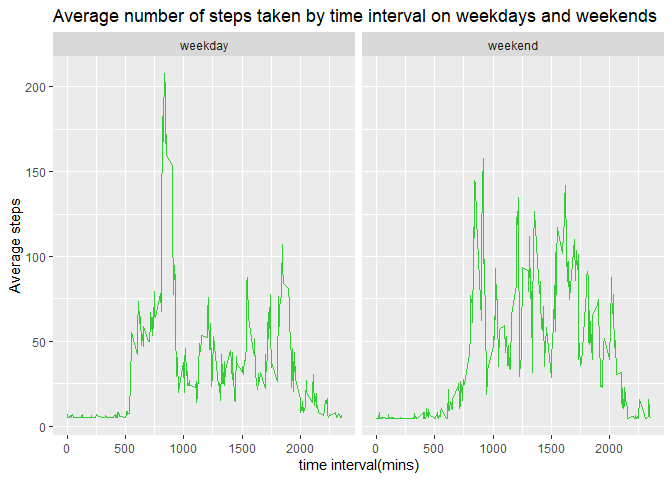

## Loading and preprocessing the data
Loading the requied packages

```r
library("Hmisc", "lubridate")
```

```
## Warning: package 'Hmisc' was built under R version 3.6.2
```

unzipping and loading the data

```r
unzip("activity.zip")
activity <- read.csv("activity.csv")
```

viewing basic information about the dataset

```r
str(activity)
```

```
## 'data.frame':	17568 obs. of  3 variables:
##  $ steps   : int  NA NA NA NA NA NA NA NA NA NA ...
##  $ date    : Factor w/ 61 levels "2012-10-01","2012-10-02",..: 1 1 1 1 1 1 1 1 1 1 ...
##  $ interval: int  0 5 10 15 20 25 30 35 40 45 ...
```

```r
head(activity, 5)
```

```
##   steps       date interval
## 1    NA 2012-10-01        0
## 2    NA 2012-10-01        5
## 3    NA 2012-10-01       10
## 4    NA 2012-10-01       15
## 5    NA 2012-10-01       20
```

```r
tail(activity, 5)
```

```
##       steps       date interval
## 17564    NA 2012-11-30     2335
## 17565    NA 2012-11-30     2340
## 17566    NA 2012-11-30     2345
## 17567    NA 2012-11-30     2350
## 17568    NA 2012-11-30     2355
```

```r
summary(activity)
```

```
##      steps                date          interval     
##  Min.   :  0.00   2012-10-01:  288   Min.   :   0.0  
##  1st Qu.:  0.00   2012-10-02:  288   1st Qu.: 588.8  
##  Median :  0.00   2012-10-03:  288   Median :1177.5  
##  Mean   : 37.38   2012-10-04:  288   Mean   :1177.5  
##  3rd Qu.: 12.00   2012-10-05:  288   3rd Qu.:1766.2  
##  Max.   :806.00   2012-10-06:  288   Max.   :2355.0  
##  NA's   :2304     (Other)   :15840
```

Converting the date from class factor to class dates

```r
library("lubridate")
```

```
## 
## Attaching package: 'lubridate'
```

```
## The following object is masked from 'package:base':
## 
##     date
```

```r
activity$date <- ymd(activity$date)
```

## What is mean total number of steps taken per day?
Calculating the total number of steps taken per day (ignoring missing values)

```r
steps_per_day <- aggregate(steps ~ date, activity, sum)
```

Plotting a Histogram of the total number of steps taken per day

```r
ggplot(data = steps_per_day, mapping = aes(x = steps)) + 
        geom_histogram(fill = "limegreen", bins = 20) +
        labs(title = "Total number of steps taken each day", x = "steps per day", y = "Frequency")
```

<!-- -->

Mean and median of the total number of steps taken per day

```r
mean(steps_per_day$steps, na.rm = TRUE)
```

```
## [1] 10766.19
```

```r
median(steps_per_day$steps, na.rm = TRUE)
```

```
## [1] 10765
```

## What is the average daily activity pattern?
A time series plot of the 5-minute interval (x-axis) and the average number of steps taken, averaged across all days (y-axis)

```r
average_interval <- aggregate(steps ~ interval, activity, mean)
ggplot(data = average_interval, aes(x = interval, y = steps)) + 
        geom_line(color = "limegreen") +
        labs(title = "Average number of steps taken by 5-minute interval", 
             x = "time interval(mins)", y= "Average number of steps")
```

<!-- -->

5-5-minute interval, on average across all the days in the dataset, containing the maximum number of steps

```r
average_interval[which.max(average_interval$steps), 1]
```

```
## [1] 835
```

## Imputing missing values
The total number of missing values in the dataset (i.e. the total number of rows with NAs)

```r
sum(is.na(activity$steps))
```

```
## [1] 2304
```

Filling in all of the missing values in the dataset

```r
steps_imputed <- with(activity, impute(steps, mean))
```

Creating a new dataset that is equal to the original dataset but with the missing data filled in

```r
activity2 <- cbind(steps_imputed, activity)
activity2 <- activity2[ , -2]
head(activity2, 10)
```

```
##    steps_imputed       date interval
## 1        37.3826 2012-10-01        0
## 2        37.3826 2012-10-01        5
## 3        37.3826 2012-10-01       10
## 4        37.3826 2012-10-01       15
## 5        37.3826 2012-10-01       20
## 6        37.3826 2012-10-01       25
## 7        37.3826 2012-10-01       30
## 8        37.3826 2012-10-01       35
## 9        37.3826 2012-10-01       40
## 10       37.3826 2012-10-01       45
```

Plotting Histogram of the total number of steps taken each day 

```r
daily_steps <- aggregate(steps_imputed ~ date, activity2, sum)

ggplot(data = daily_steps, mapping = aes(x = steps_imputed)) + 
        geom_histogram(fill = "limegreen", bins = 20) +
        labs(title = "Total number of steps taken each day", x = "steps per day", y = "Frequency")
```

<!-- -->

Mean and median total number of steps taken per day

```r
Mean_steps <- mean(daily_steps$steps_imputed)
Median_steps <- median(daily_steps$steps_imputed)
```

## Are there differences in activity patterns between weekdays and weekends?
Creating a variable in the dataset with two levels – “weekday” and “weekend” indicating whether a given date is a weekday or weekend day

```r
day_type <- function(day){
        if(wday(day) %in% c(1,7))
                name <-"weekend"
        else
                name <-"weekday"
        name
}
activity2$day <- sapply(activity2$date, day_type)
head(activity2, 5)
```

```
##   steps_imputed       date interval     day
## 1       37.3826 2012-10-01        0 weekday
## 2       37.3826 2012-10-01        5 weekday
## 3       37.3826 2012-10-01       10 weekday
## 4       37.3826 2012-10-01       15 weekday
## 5       37.3826 2012-10-01       20 weekday
```

A plot containing a time series plot of the 5-minute interval (x-axis) and the average number of steps taken, averaged across all weekday days or weekend days (y-axis)

```r
average_interval2 <- aggregate(steps_imputed ~ interval + day, activity2, mean)

ggplot(data = average_interval2, aes(x = interval, y = steps_imputed)) + 
        geom_line(color = "limegreen") + 
        facet_wrap(day ~ .) +
        labs(title = "Average number of steps taken by time interval on weekdays and weekends",
            x = "time interval(mins)", y = "Average steps" )
```

<!-- -->

